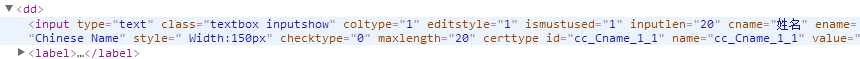
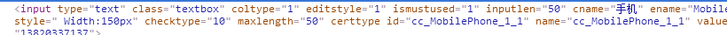

# 表单优化
***
[某网申表单](http://xyz.51job.com/External/Personal/DefaultResume.aspx)

* 关于表单字符长度问题，超出长度后点击提交才会有提示
  　　
　　

　　

　　可以在给`<input>`添加`placeholder`属性来提示可输入字符长度

* 在输入英文名的地方可以输入中文，并且点击提交的时候也没有提示错误

　　
  
　　可加入正则表达式控制只能输入英文

* 表单中性别选择使用`<select>`,个人觉得使用`radio`比较方便

* 手机号长度控制不合理，

　　

　　应该控制`<maxlength=11>`,同样存在字符输入问题

　　该表单存在问题主要为字符输入和长度控制问题

