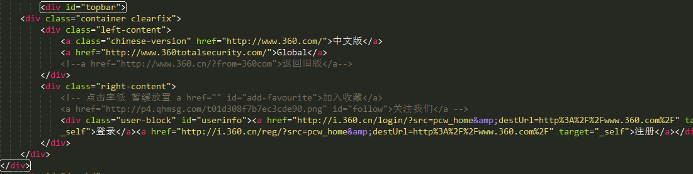
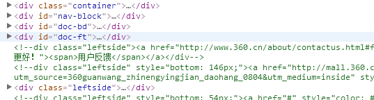
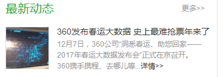
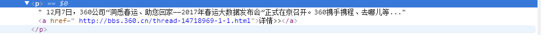

# 网页找茬
[原始页面](http://www.360.cn/)
***

* 网页中规定字符的`<meta>`标签为：`<meta http-equiv="Content-Type" content="text/html; charset=UTF-8">`个人认为可以直接写为:```<meta charset="utf-8">```

* `<meta>`部分可以添加`<meta http-equiv="X-UA-Compatible"content="IE=edge,chrome=1">`以使得当浏览器问IE浏览器是以IE最高模式渲染，当安装了Google Chorme Frame时则使用GCF渲染页面

* 头部：


　　


　　可使用`<header>`标签包裹以增强语义化，同样，底部也可用`<footer>`包裹，`<nav>`定义包裹导航栏

* 页面中所有的区块均用`<div>`分割：


　　


　　个人以为可用`<section>`分割每个部分

* 最新动态里的部分内容应该算引用吧 

 　　
 
 　　

　　　应使用`<q>`标签
 


